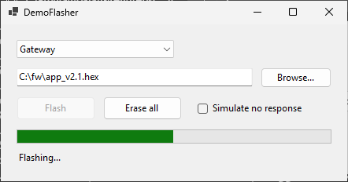
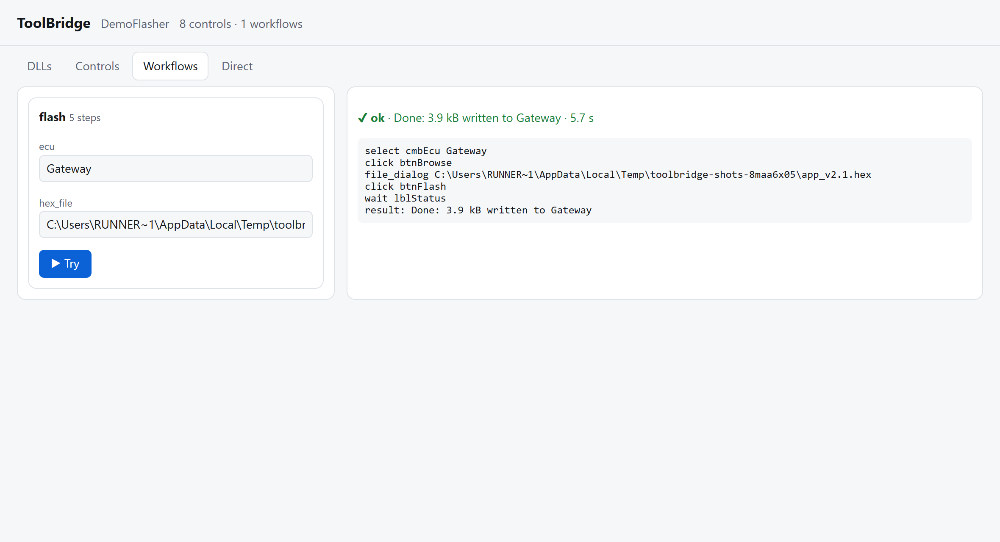
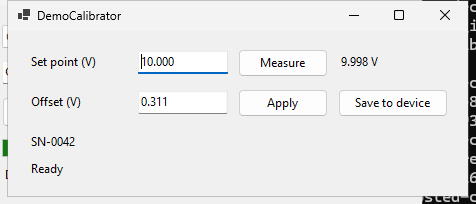
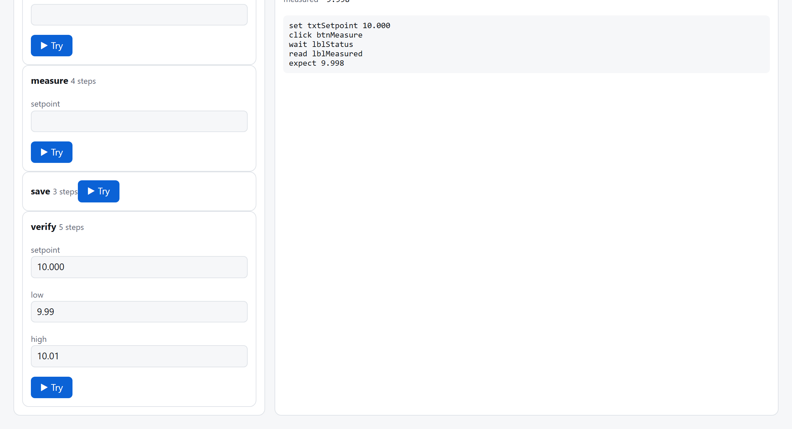
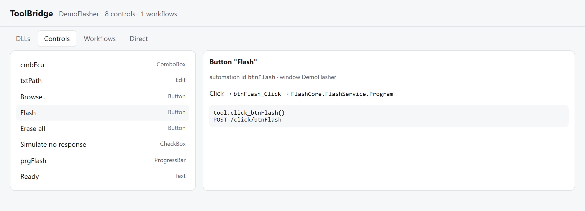
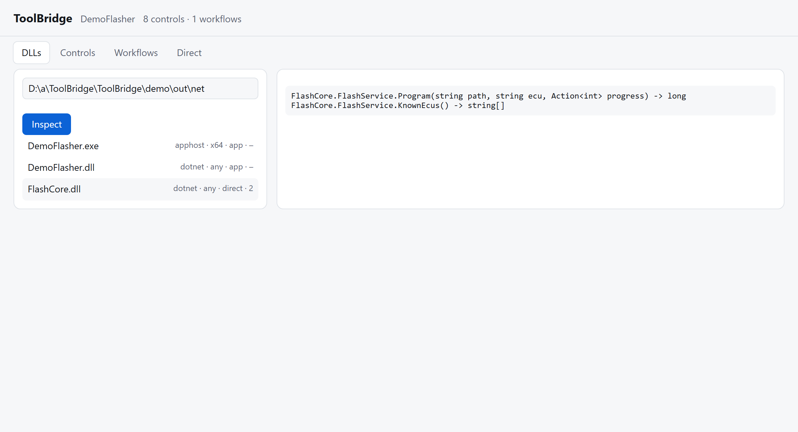

<p align="center">
  <picture>
    <source media="(prefers-color-scheme: dark)" srcset="docs/logo/toolbridge-logo-dark.svg">
    
  </picture>
</p>

<p align="center"><b>An API for Windows tools that never got one.</b></p>

<p align="center">
  <a href="https://github.com/Alifizz01/ToolBridge/actions/workflows/ci.yml"></a>
  
  
  
</p>

A lot of engineering software only has a GUI: the supplier's ECU flasher, the calibration program
that came with the test stand, the configurator nobody has the source code for. When a test bench
needs one of them, a person clicks through it, or someone writes a script that clicks at pixel
positions and breaks the next time the window moves.

ToolBridge reads the tool, both its window and its DLLs, and generates a real API for it: a Python
package to import in your tests, and a REST endpoint anything else can call. It uses no AI and no
image matching, only what Windows already exposes: UI Automation for the controls, and .NET
metadata for the code behind each button.

<table>
<tr>
<td width="38%"></td>
<td></td>
</tr>
<tr>
<td>A flasher with no API, being driven…</td>
<td>…by <code>POST /workflows/flash {"ecu": "Gateway", "hex_file": "C:\fw\app_v2.1.hex"}</code></td>
</tr>
</table>

## Why this exists

I wrote ToolBridge after a project on automated ECU testing. The test sequence was scripted end to
end except for one step: flashing. The supplier's flashing tool had no API and no command line, so
every test run had a person in the loop. The same thing happened again with calibration software
on a machine. Both times the tool was fine; it just could not be called from anywhere.

| without ToolBridge | with ToolBridge |
|---|---|
| Someone clicks through the tool for every run | `tool.flash(ecu="ECU1", hex_file=...)` inside pytest |
| Click-at-coordinates scripts break when the window or DPI changes | Controls are found by their automation id, with label and tree position as fallbacks |
| An unexpected "Are you sure?" or error box blocks the run | Popups are read, closed, and returned as a failed result with their text |
| "Which of these 40 DLLs does the work?" | `toolbridge inspect` follows the imports and lists their functions |
| Nobody knows what the Flash button actually calls | The scan traces `btnFlash.Click → FlashCore.FlashService.Program(string, string, Action<int>)` |

## What a session looks like

The `inspect` and `scan` output below is real, captured in CI from the demo tools in this repo by
[`tools/screenshots.py`](tools/screenshots.py). The `record` session shows the prompts you get.

**0. Which DLL matters?** Run against the tool's install folder; the tool does not need to be running.

```text
> toolbridge inspect demo\out\net
file                              kind     bit   used by app               functions
DemoFlasher.exe                   apphost  x64   app                       -
DemoFlasher.dll                   dotnet   any   app                       -
FlashCore.dll                     dotnet   any   direct                    2

> toolbridge inspect demo\out\net --dll FlashCore.dll
  FlashCore.FlashService.Program(string path, string ecu, Action<int> progress) -> long
  FlashCore.FlashService.KnownEcus() -> string[]
```

Runtime and system DLLs are hidden (`--all` shows them). In a real install folder with dozens of
DLLs, the ones the app actually loads come first.

**1. Scan.** This starts the tool and lists every control. For .NET tools it also reads the IL of
each button handler to find what it calls.

```text
> toolbridge scan demo\out\net\DemoFlasher.exe --dll demo\out\net\FlashCore.dll
8 controls in 'DemoFlasher', 3 traced handlers, 0 native exports
  btnFlash.Click -> FlashCore.FlashService.Program
```

**2. Record.** Do the job once by hand. ToolBridge notes every click, every value you type or
pick, and every file you choose in a dialog. You then say which values become parameters.

```text
> toolbridge record flash
Recording 'flash'. Do the workflow in DemoFlasher now, then press Enter here...
select cmbEcu = 'ECU1'. Parameter name (empty = keep fixed): ecu
file_dialog file = 'C:\fw\app_v2.1.hex'. Parameter name (empty = keep fixed): hex_file
Which control shows the result? (e.g. lblStatus): lblStatus
Pattern that means success (regex, e.g. ^Done): ^Done
workflow flash(ecu, hex_file) with 5 steps
-> toolbridge-project\workflows\flash.yaml
```

The result is a short YAML file you can read and edit ([reference](docs/workflow-reference.md)).

**3. Use it.**

```python
from demoflasher_api import Tool          # written by `toolbridge generate`

tool = Tool()
r = tool.flash(ecu="Gateway", hex_file=r"C:\fw\app_v2.1.hex")
assert r.ok, r.message                     # "Done: 3.9 kB written to Gateway"
```

```powershell
toolbridge serve            # REST API + Studio on http://127.0.0.1:8750, OpenAPI docs at /docs
curl -X POST http://127.0.0.1:8750/workflows/flash -H "content-type: application/json" `
     -d '{"ecu": "Gateway", "hex_file": "C:/fw/app_v2.1.hex"}'
```

## Not just flashing: calibration

The second demo is a measurement channel that reads 0.31 V high, like an instrument before
calibration. Four small workflows (`measure`, `apply_offset`, `verify`, `save`) and a few lines of
Python calibrate it:

```python
cal = Tool()
before = cal.measure(setpoint="10.000").values["measured"]          # 10.311
cal.apply_offset(offset=f"{before - 10:.3f}")                       # 0.311
check = cal.verify(setpoint="10.000", low="9.99", high="10.01")     # measured 9.998: ok
assert check.ok, check.message      # e.g. "measured is 10.04, expected between 9.99 and 10.01"
cal.save()
```

<table>
<tr>
<td width="38%"></td>
<td></td>
</tr>
</table>

`read` steps pick numbers out of whatever the tool prints (`"10,37 V"` gives `10.37`), `expect`
checks a range or a pattern, and every value read ends up in `result.values`. Loops and decisions
stay in Python, where they are easy to read.

## Fitting it to your tool

Every tool is a bit different, so the parts that differ live in the project folder, not in
ToolBridge:

```text
toolbridge-project/
  toolbridge.yaml      app path, DLLs, deny-list, opt-in direct calls, timeouts
  target.json          the scan: controls, traced handlers, exports
  workflows/*.yaml     recorded or hand-written workflows
  steps.py             your own step types (optional)
  runs/                failure screenshots
```

```python
# steps.py: anything the built-in steps do not cover
from toolbridge.workflow import register_step

@register_step("zero_sensor")
def zero_sensor(session, step, ctx):
    session.click("btnZero")
    session.wait_text("lblStatus", "^Zeroed", 30)
```

```yaml
# toolbridge.yaml
deny: [btnEraseAll, btnFactoryReset]          # never touched by workflows, the API or REST
direct: [FlashCore.FlashService.KnownEcus]    # .NET methods callable without the GUI
```

Built-in steps: `click`, `set`, `select`, `check`, `file_dialog`, `wait`, `read`, `expect`, `keys`,
`menu`, `sleep`. Details: [workflow reference](docs/workflow-reference.md) ·
[using it on your own tool](docs/getting-started.md).

## Studio

`toolbridge serve` also serves a small web page on the same port. It shows the DLLs, the controls
with their traced calls and the matching Python and REST calls, and lets you run any workflow with
a form.





## How it works

| piece | built on | does |
|---|---|---|
| `scan/inspect.py` | pefile, dnfile | classifies every binary in a folder and follows imports from the exe (including .NET apphosts, where the code is in `App.dll`) |
| `scan/dotnet.py` | dnfile, dncil | decodes method signatures, and reads `InitializeComponent` IL to map `control.Click → handler → calls`, following async state machines and lambdas |
| `scan/native.py` | pefile, dbghelp | lists exports and demangles MSVC C++ names; **never calls them** |
| `runtime.py` | pywinauto (UIA) | finds controls by automation id, then label + type, then tree path; non-blocking clicks; waits; popup and file-dialog handling; deny-list; one action at a time |
| `record.py` | low-level mouse hook | the hook only notes the element under each click; a worker thread compares input values between clicks, which captures typing, drop-downs and file dialogs |
| `direct.py` | pythonnet | opt-in calls into .NET methods, with a 32/64-bit check |
| `generate.py`, `server.py` | FastAPI | a plain Python package per tool, and the REST API + Studio |

## Tests

**44 tests**, run on GitHub's `windows-latest` with Python 3.10 and 3.12. They build three demo
tools from source: DemoFlasher (C# WinForms), the same flasher in native C++/Win32, and
DemoCalibrator. The tests then drive those tools for real: scanning, tracing, recording with
synthetic mouse and keyboard input, replaying workflows through Python, REST and direct calls,
handling error popups, the deny-list, and calibrating to within ±0.01 V.

Tests that open windows only run when `TOOLBRIDGE_UI=1`, so `pytest` on your own PC does not take
over your screen:

```powershell
./demo/build.ps1            # .NET 8 SDK + Visual Studio C++ tools
pip install -e ".[dev]"
pytest                      # 28 pass, the 16 UI tests are skipped
$env:TOOLBRIDGE_UI = "1"; pytest
```

## Limits

ToolBridge only sees what UI Automation sees, so custom-painted controls show up as a single pane.
It needs an unlocked desktop session. Controls on unopened tabs only exist once the tab is shown.
WPF tools get the GUI API but no button-to-method tracing yet. The full list:
[docs/limits.md](docs/limits.md). Also check whether the licence of the tool you point it at allows
reading its binaries.

## License

MIT © Muhamad Alif Izzuwan Bin Ibrahim
